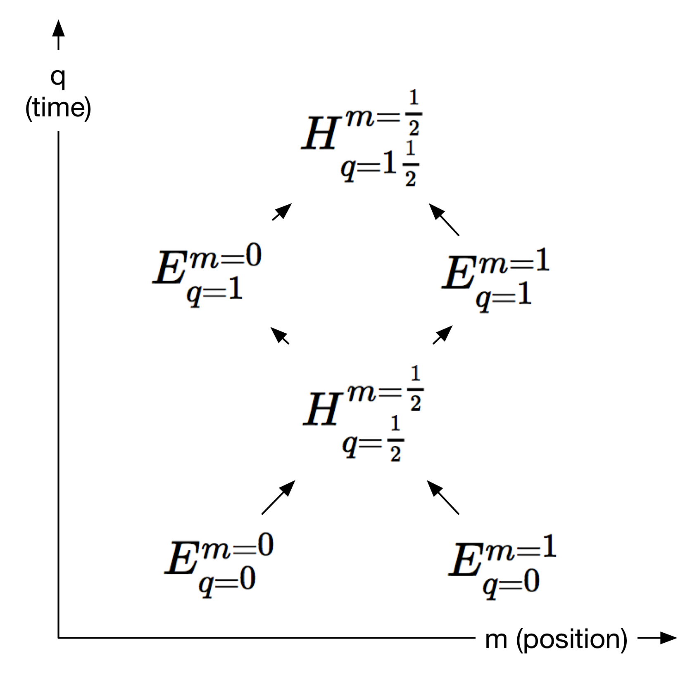

#### Yee Cell and Leapfrog Method

According to [Yee][] this is discretized with $t=q\Delta\_t$ and $x=m\Delta_x$.

Taking the first equation with and using the times $q+\frac{1}{2}$ and $q-\frac{1}{2}$ and the locations $m+1$ and $m$ this gives:

$$\mu\frac{H_y((q+\frac{1}{2})\Delta_t, (m+\frac{1}{2})\Delta_x)-H_y((q-\frac{1}{2})\Delta_t, (m+\frac{1}{2})\Delta_x)}{\Delta_t}=\frac{E_z(q\Delta_t, (m+1)\Delta_x)-E_z(q\Delta_t, m\Delta_x)}{\Delta_t}$$

Solving for future $H_y$ yields

$$H_y((q+\frac{1}{2})\Delta_t, (m+\frac{1}{2})\Delta_x)=H_y((q-\frac{1}{2})\Delta_t, (m+\frac{1}{2})\Delta_x) + \underbrace{\frac{\Delta_t}{\mu\Delta_x}\left(E_z(q\Delta_t, (m+1)\Delta_x)-E_z(q\Delta_t, m\Delta_x)\right)}_\text{difference between old and new value}$$

This means the value of the magnetic field at a given point $m$ can be calculated from it's last value and the surrounding electric fields at a prior time. The difference between $H_y((q+\frac{1}{2})\Delta_t)$ and $H_y((q-\frac{1}{2})\Delta_t)$ is called the _update function_.

Likewise this calculations can be done for $E_z$ to get an update function to calculate the next value of $E_z$ from it's old value and the surrounding two $H_y$ values.

To get the electric field of any given system at a specific time this algorithm just calculates $E_z$ and $H_y$ with $q$ starting at 0 and increasing by $\frac{1}{2}$ until the required time $t = q\Delta_t$ is reached. The only needed input is the initial field of $E_z$ at $q = 0$. Because this method by turns calculates $E$ and $H$ it is also called a _leap frog method_.

To account for different materials within the system, $\mu$ can be replaced by a location or even time dependent $\mu(t, x)$.

To visualize the different points in time and space,

[Yee]: http://adsabs.harvard.edu/abs/1966ITAP...14..302Y (Numerical solution of inital boundary value problems involving maxwell's equations in isotropic media)
